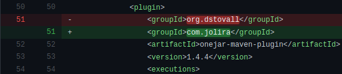
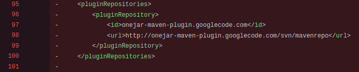
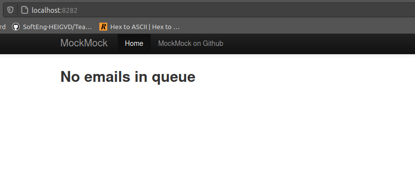
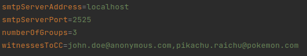
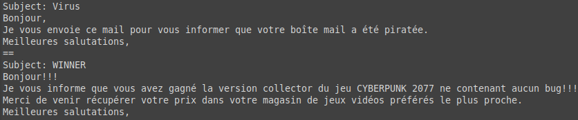
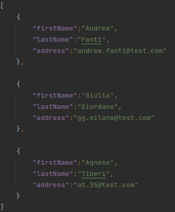
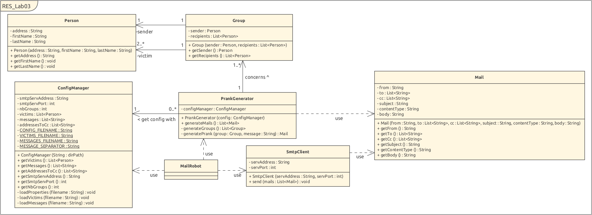

# Laboratoire 3 - SMTP

Auteurs: Alexandra Cerottini & Miguel Do Vale Lopes

Date: 29.04.2021

## Description du projet

Ce laboratoire a été réalisé dans le cadre d'un cours de réseaux (RES) suivi à la HEIG-VD, une Haute-École située en Suisse.

Le but de ce laboratoire est de développer une application client (TCP) en Java qui va utiliser une Socket API pour communiquer avec un serveur SMTP.

Cette application consiste en l'envoi de pranks par email à différents groupes contenant une liste de victimes.

## Instructions pour la configuration du serveur SMTP fictif avec Docker

Dans ce laboratoire, il nous a été recommandé d'utiliser MockMock server sur GitHub. Il disponible sur le lien suivant: https://github.com/tweakers/MockMock.  C'est un serveur SMTP multi-plateforme permettant de tester si des emails sont envoyés sans les envoyer réellement. Il nous fournit une interface web qui ressemble à une boîte mail nous permettant de consulter ce qu'on aurait envoyé si nous dirigions nos emails vers de vrais clients. Cette interface web ne nous permet pas d'envoyer des emails.

Pour installer MockMock server, il faut cloner le repos se trouvant sur le lien mentionné plus haut avec la commande `git clone` dans un terminal sur notre machine. Ensuite, il faut mettre à jour le pom.xml car une dépendance n'est plus à jour. Pour se faire, il suffit d'ouvrir le pom.xml et de remplacer le plugin contenant le groupId ***org.dstovall*** par ***com.jolira***. 

Il faut donc remplacer ce qui est en rouge sur l'image par ce qui est en vert.

De plus, il faut supprimer les différentes lignes en rouge ci-dessous:

Pour démarrer le serveur, il faut ouvrir un terminal à l'emplacement des fichiers du serveur MockMock et faire un `mvn clean install`. Ensuite il faut aller dans le fichier *target* et lancer `java -jar MockMock-1.4.0.one-jar.jar -p 2525`.  2525 est le port de notre choix. Par défaut, le serveur MockMock écoute sur le port 25 mais celui-ci peut entraîner quelques soucis car il faut des droits administrateur sur certains systèmes pour y permettre l'écoute. Si le port souhaite être changé, il faut également le modifier dans le fichier `config.properties` (voir prochaine section).

Lorsque le serveur est démarré, la boîte mail du serveur MockMock peut être consultée dans un navigateur en tapant `localhost:8282`.  Si un autre port que le 8282 souhaite être utilisé, il faut relancer le fichier *.jar* avec la commande `java -jar MockMock-1.4.0.one-jar.jar -h <port>` en remplaçant *<port>* par le port souhaité.

Voici à quoi ressemble l'interface web lorsqu'elle est lancée. Celle-ci peut directement être utilisée avec notre programme.

Si l'on souhaite implémenter le serveur MockMock avec Docker...........

##### TODO:  Comment installer mockmock + docker

## Configuration du projet

Pour envoyer un prank à une liste de victimes, il suffit de modifier trois fichiers dans le dossier *config* principal.

### config.properties

Ce fichier contient la configuration principale du programme.

**smtpServerAddress**: permet de spécifier l'adresse du serveur SMTP. Si vous souhaitez utiliser le serveur MockMock, spécifier `localhost`. 
:warning: Ce champ est obligatoire. 

**smtpServerPort**: permet de spécifier le numéro de port pour l'écoute du serveur SMTP. 
:warning: Ce champ est obligatoire.

**numberOfGroups**: permet de spécifier le nombre de groupe que l'on souhaite. Un groupe est composé au minimum d'un envoyeur et de deux victimes donc de trois personnes. Les différents rôles seront attribués aléatoirement par le programme.
:warning: Ce champ est obligatoire.

**witnessesToCC**: permet de spécifier l'adresse ou les adresses des personnes qui devraient recevoir le email en copie. Ce champ n'est pas obligatoire. Si vous spécifiez deux emails ou plus, il faut qu'ils soient séparés par une virgule sans aucun espace.

 

### messages.utf8

Ce fichier contient la liste des différents messages que l'on souhaite envoyer.

Chaque mail doit être séparé par les deux caractères `==` comme dans l'exemple ci-dessus. Le *Subject* correspond à l'objet du email. Chaque email sera automatiquement signé par le nom et prénom de la victime choisie aléatoirement.

### victims.json

Ce fichier contient la liste des différentes victimes à qui l'on souhaite envoyer nos pranks.

Le format doit toujours être respecté et il doit y avoir au moins trois victimes pour un groupe.

**firstname**: le prénom de la victime

**lastname**: le nom de la victime

**address**: le email de la victime

Lorsque ces fichiers sont correctement configurés, il suffit de lancer le programme ou alors ouvrir un terminal et faire un `mvn clean install` à la racine du projet (c'est-à-dire dans le dossier *RES_Lab03_SMTP*), puis lancer le *.jar* avec la commande `java -jar target/Lab03-1.0-SNAPSHOT.jar  ` . 

## Description de notre implémentation

Voici le diagramme de notre programme:

### Person

Cette classe nous permet de créer une personne qui comporte un nom, un prénom et une adresse email.

### Group

Cette classe nous permet de créer un groupe de personnes contant un envoyeur (sender) et une liste de receveurs (recipients).

### Mail

Cette classe nous permet de créer un email. Celui-ci contient le email du sender (from), le ou les emails des receveurs (to), le ou les emails des personnes en copie (cc), l'objet du email (subject), le contenu du mail (body) ainsi que le contentType qui permet de spécifier le type de média internet du contenu du message. Dans notre cas, nous utilisons un `text/plain` et le charset est `utf-8`.

### ConfigManager

Cette classe nous permet de configurer le programme avec ce que contient le dossier *config* principal. On va obtenir les données de configurations. Il nous permet notamment de regrouper les différentes victimes et les messages. 

### PrankGenerator

Cette classe permet de générer les différents pranks que nous allons envoyer. On implémente la logique métier spécifique à l'application, les spécifications fonctionnelles.  Pour se faire, elle génère tout d'abord les différents emails, groupes et pranks. 

### SmtpClient

Cette classe implémente le protocole SMTP et envoie des emails. C'est ici que le client va parler avec le serveur en lui envoyant des requêtes et en obtenant ses réponses tout en respectant les conventions du protocole SMTP.

### MailRobot

Cette classe permet de lancer notre programme.

##### todo: inclure des exemples de dialogues entre client et serveur????

